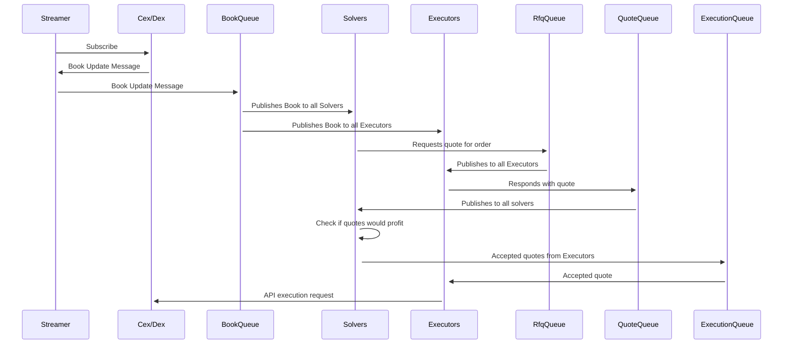

# Quotation Station

> DISCLAIMER: This is a proof of concept and should not be used in production. This system is HIGHLY EXPERIMENTAL and should be treated as such. The author of this repository emphasizes that running this code in production is at your own risk. This is a entirely novel and untested system and could result in catastrophic loss of funds.

Now that we've clariried the risks, let's talk about exchanges, trading and the future of value exchange.

## About Quotation Station

Quotation Station is a multi-agent system built on [Olas](https://olas.network) and is designed to demonstrate an alternative approach to value exchange using decentralised agents.

## Rationale

At present, most high-volume traders use exchanges like Binance, Kraken, or Bitfinex. These exchanges facilitate order matching and exectuion, and provide wallet services to store assets. However, this centralisation contradicts the decentralised philosophy of web3 and blockchain technology, and has led to significant issues including hacks, downtimes, or regulatory shutdowns (e.g. Mt. Gox, Bitfinex, Coinbase, Binance).

Centralised exchanges pose several drawbacks:

-   Single point of failure: If the exchange is hacked, or goes down, trading halts. 
-   Control over assets: Exchanges holding assets can be risky for traders if compromised.

Web3 offers a potential solution by enabling direct, smart contract-based trading between users, eliminating the need for a centralised intermediary. This removes the single point of failure and the necessity for exchanges to hold assets.

## Evolution of Decentralised Exchanges

The first generation of decentralised exchanges (DEXs), such as UniSwap, allowed trustless, direct trading of ERC20 tokens without a central authority. However, these DEXs faced challenges such as:

-   Slow and expensive transctions
-   Limited to ERC20 tokens
-   Requiring liquidity provison, exposing traders to risks like impermanent loss

Despite these drawbacks, DEXs like UniSwap introduced smart contract-based trading, enhancing security by removing the need for centralized asset custody.

Next-generation exchanges like [100x](https://100x.finance) and [Lyra](https://lyra.finance) combine centralized matching engines with decentralized settlement layers, offering speed and low costs while maintaining security and trustlessness. However, they still pose a single point of failure and require traders to deposit assets, impacting privacy and security.

## Trends and Future Directions

Historical economic trends show a move from centralization to decentralization and from intermediaries to direct user interactions. For instance:

-   Airbnb: Connects property owners with renters, bypassing traditional rental platforms.
-   Uber: Connects drivers with passengers, eliminating the need for centralized taxi services.
-   Amazon: Connects sellers with buyers, removing the necessity for centralized retail platforms.

Applying these trends to financial markets suggests a shift towards decentralized exchanges and direct interaction between traders. Currently, most crypto trades are conducted manually, but as technology evolves, algorithmic trading agents will become more prevalent.

The rise of AI technologies like ChatGPT has sparked interest in AI trading agents, capable of understanding natural language and trading autonomously on behalf of humans.

## The Next Step

Imagine a world where traders could interact directly without centralised exchanges. This future trading ecosystem would:

-   Eliminate single points of failure
-   Allow assets to remain in traders' wallets
-   Remove the need for an exchanged managed order book
-   Enable 24/7, millisecond-level trade execution 

Built from the ground up for crypto-native agents, Olas provides the orchestration and communication layer for such a decentralised agent system.

## Architecture



## Agent Breakdown and Responsibilities

### Streamer

-   Subscribes to exchanges and receives order book updates.
-   Publishes updates to the book queue.

### Solvers

-   Receive order book updates from the book queue.
-   Request quotes from executors for orders.
-   Check if quotes are profitable; if so, accept and publish to the execution queue.

### Executors

-   Receive order book updates from the book queue.
-   Respond to solvers' quote requests.
-   Hedge trades on the exchange.

### Economists

-   Monitor solvers and executors to ensure beneficial behavior for the system.
-   Oversee system functioning, orchestrating queues, and ensuring correct agent interactions.

## Interaction & Communication

The agents interact with each other using the Olas network, communicating via messages. They subscribe to topics and publish messages to topics, request and respond to quotes.

This system is designed to be fully decentralised and trustless with agents ensuring mutually beneficial behaviour.

## Roadmap

1.  **Prototype Development**
    -   Build streamer, solvers, executors, and economists
    -   Construct book queue, RFQ queue, quote queue, and execution queue.
    -   Initially, run the system on a private network with the agents operated by an economist agent using Terraform and single agent services.

2.  **Arbitrage Testing**
    -   Solvers detect arbitrage opportunities, and if so, they will request quotes from the executors.
    -   Executors will respond with quotes, and the solvers will check if the quotes would profit.
    -   If the quotes would profit, the solvers will accept the quotes and publish the accepted quotes to the execution queue.
    -   Executors will then hedge the trades on the exchange.

3.  **Agent-to-Agent Trades**
    -   Implement peer-to-peer trading for agents.
    -   Develop a public UI for trustless human or agent interaction.

4.  **User Interaction**
    -   Build a web3 frontend allowing users to interact with the system via wallets to request and accept quotes.

5.  **Decentralise queues**
    -   Build a decentralised messaging layer for trustless agent communication.

6.  **Decentralise Agents**
    -   Develop a security model for price feeds and ensure beneficial agent behavior system-wide.


## Table of Contents

- [Getting Started](#getting-started)
  - [Installation](#installation)
  - [Setup for Development](#setup-for-development)
- [Usage](#usage)
- [Commands](#commands)
  - [Testing](#testing)
  - [Linting](#linting)
  - [Formatting](#formatting)
  - [Releasing](#releasing)
- [License](#license)

## Getting Started

### Installation and Setup for Development

If you're looking to contribute or develop with `quotation_station`, get the source code and set up the environment:

```shell
git clone https://github.com/eightballer/quotation_station --recurse-submodules
cd quotation_station
make install
```

## Commands

Here are common commands you might need while working with the project:

### Formatting

```shell
make fmt
```

### Linting

```shell
make lint
```

### Testing

```shell
make test
```

### Locking

```shell
make hashes
```

### all

```shell
make all
```

## License

This project is licensed under the [Apache License 2.0](https://www.apache.org/licenses/LICENSE-2.0)

